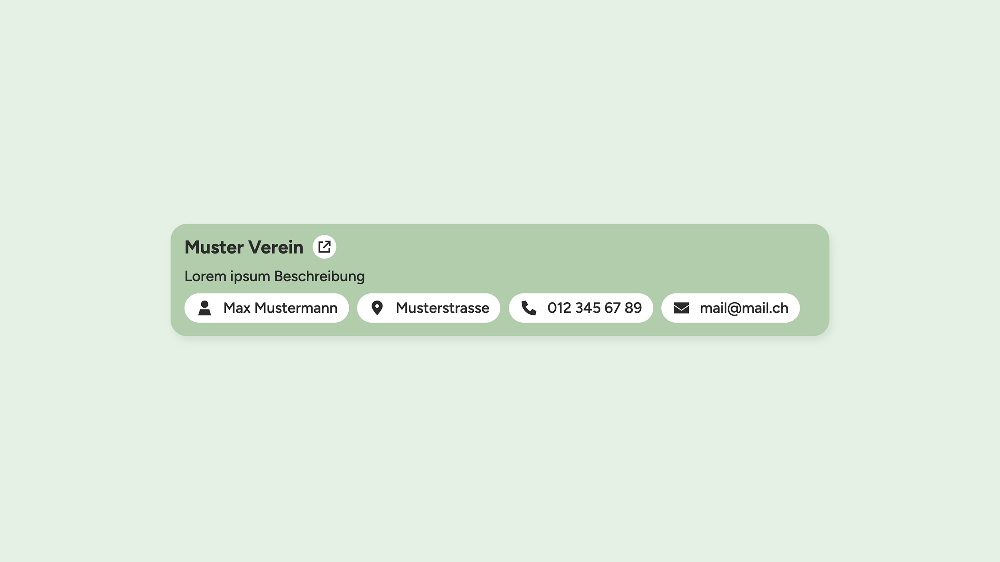
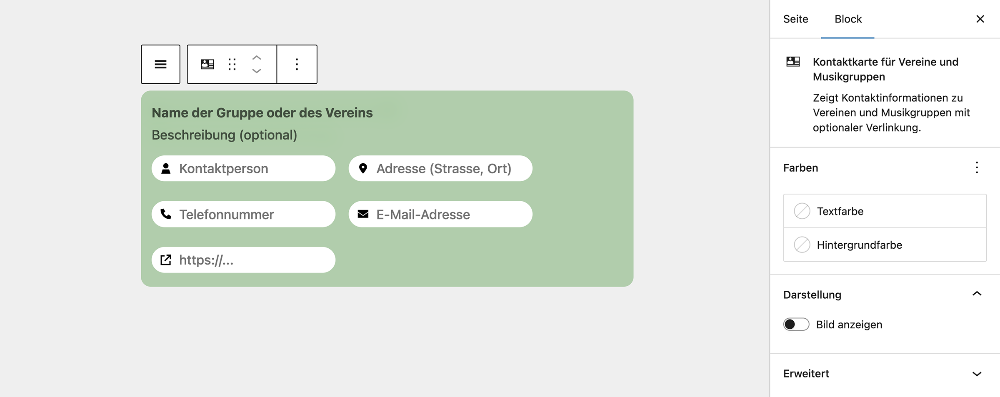

# UD Block: Contact Card – Associations & Music

Block zur Darstellung von Kontaktinformationen für Vereine, Musikgruppen oder ähnliche Organisationen.
Die Daten können direkt im Editor eingegeben und optional mit einem Bild oder einer Website verknüpft werden.

## Funktionen

- Zeigt Name, Beschreibung, Kontaktperson, Adresse, Telefon, E-Mail und Website an
- Optionales Bildfeld zur visuellen Ergänzung
- Wenn eine Website hinterlegt ist, erscheint automatisch ein Button neben dem Vereinsnamen
- Vollständig editierbar im Gutenberg-Editor
- Serverseitiges Rendering über `render.php`
- Kompatibel mit Full Site Editing (FSE)

## Screenshots

*Frontend-Ansicht.*

*Editor-Ansicht.*

## Autor

[ulrich.digital gmbh](https://ulrich.digital)

## Lizenz

GPL v2 or later
[https://www.gnu.org/licenses/gpl-2.0.html](https://www.gnu.org/licenses/gpl-2.0.html)

